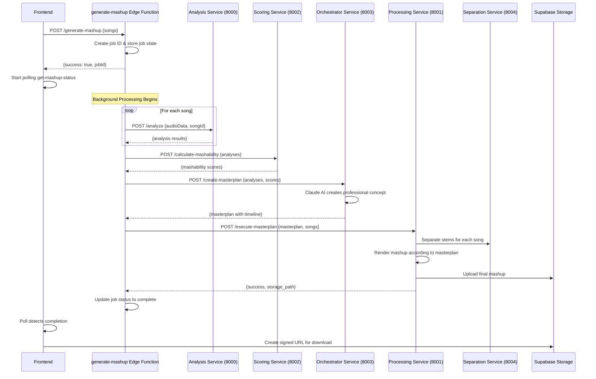

# Design Document

## Overview

This design implements a complete real-time mashup generation system that orchestrates the existing Python microservices architecture. The system will replace the current mock implementation with actual service calls while preserving all existing robust code, UI components, and Claude AI's role as the professional story and song creator.

## Architecture

### Service Orchestration Flow



### Job State Management

The system will use a simple in-memory job state store within the edge function for tracking progress:

```typescript
interface JobState {
  jobId: string;
  status: 'processing' | 'complete' | 'failed';
  progress: number;
  currentStep: string;
  songs: Song[];
  analyses?: AnalysisResult[];
  mashabilityScore?: any;
  masterplan?: any;
  result_url?: string;
  error_message?: string;
  created_at: Date;
}
```

## Components and Interfaces

### Enhanced Edge Functions

#### generate-mashup Function
- **Input**: Array of song objects with storage paths
- **Process**: 
  1. Create job ID and initialize job state
  2. Trigger background processing chain
  3. Return job ID immediately for polling
- **Output**: `{success: true, jobId: string}`

#### get-mashup-status Function  
- **Input**: `{jobId: string}`
- **Process**: Look up job state and return current status
- **Output**: Job state with progress, current step, and results

### Background Processing Chain

The `generate-mashup` function will implement a background processing chain that calls each service in sequence:

1. **Audio Analysis Phase**
   - Download audio files from storage
   - Convert to base64 for analysis service
   - Call analysis service for each song
   - Store analysis results in job state

2. **Compatibility Scoring Phase**
   - Call scoring service with all analyses
   - Store mashability scores in job state

3. **Creative Masterplan Phase**
   - Call orchestrator service (Claude AI)
   - Claude creates professional concept, title, and detailed timeline
   - Store masterplan in job state

4. **Audio Rendering Phase**
   - Call processing service with masterplan
   - Processing service handles stem separation and rendering
   - Final mashup uploaded to storage
   - Update job state with result URL

### Preserved Existing Components

All existing robust code will be maintained:

- **Frontend Components**: MashupZone, TrackAnalysisDisplay, MashupTimeline, ClaudeCollaboration
- **Hooks**: useMashupGenerator, useAudioAnalysis  
- **Python Services**: All existing analysis, scoring, orchestrator, processing, and separation services
- **Claude AI Integration**: Maintains role as professional story and song creator with detailed masterplans

## Data Models

### Song Analysis Integration
```typescript
interface EnhancedSong extends Song {
  analysis?: AnalysisResult; // From existing analysis service
  storage_path: string;      // Required for processing
}
```

### Masterplan Structure (from existing orchestrator)
```typescript
interface Masterplan {
  creative_vision: string;
  masterplan: {
    title: string;
    artistCredits: string;
    global: {
      targetBPM: number;
      targetKey: string;
      timeSignature: [number, number];
    };
    timeline: Array<{
      time_start_sec: number;
      duration_sec: number;
      description: string;
      energy_level: number;
      layers: Array<{
        songId: string;
        stem: string;
        volume_db: number;
        effects: string[];
      }>;
    }>;
    problems_and_solutions: Array<{
      problem: string;
      solution: string;
    }>;
  };
}
```

## Error Handling

### Service Communication
- **Retry Logic**: Exponential backoff for service calls
- **Timeout Handling**: 30-second timeouts with graceful degradation
- **Network Errors**: Clear error messages with retry suggestions

### Audio Processing Errors
- **Invalid Files**: Validate audio format before processing
- **Corruption Detection**: Handle corrupted audio gracefully
- **Size Limits**: Enforce reasonable file size limits

### State Management
- **Job Cleanup**: Automatic cleanup of old job states
- **Memory Management**: Prevent memory leaks in long-running processes
- **Concurrent Jobs**: Handle multiple simultaneous mashup generations

## Testing Strategy

### Integration Testing
- **Service Chain Testing**: Test complete flow from upload to final mashup
- **Error Scenario Testing**: Test each failure mode and recovery
- **Performance Testing**: Ensure reasonable processing times

### Component Testing  
- **Edge Function Testing**: Test job state management and service orchestration
- **Frontend Integration**: Test polling mechanism and UI updates
- **Service Communication**: Test all service-to-service calls

### User Experience Testing
- **Progress Feedback**: Verify users see meaningful progress updates
- **Error Messages**: Ensure error messages are actionable
- **Audio Quality**: Validate final mashup quality meets expectations

## Performance Considerations

### Scalability
- **Concurrent Processing**: Handle multiple mashup jobs simultaneously
- **Resource Management**: Prevent resource exhaustion during peak usage
- **Caching**: Cache analysis results for repeated songs

### Optimization
- **Streaming Processing**: Use streaming where possible to reduce latency
- **Parallel Analysis**: Analyze multiple songs concurrently
- **Efficient Storage**: Optimize audio file storage and retrieval

This design preserves all existing robust code while implementing the real mashup generation pipeline, maintaining Claude AI as the creative professional, and providing a seamless user experience.